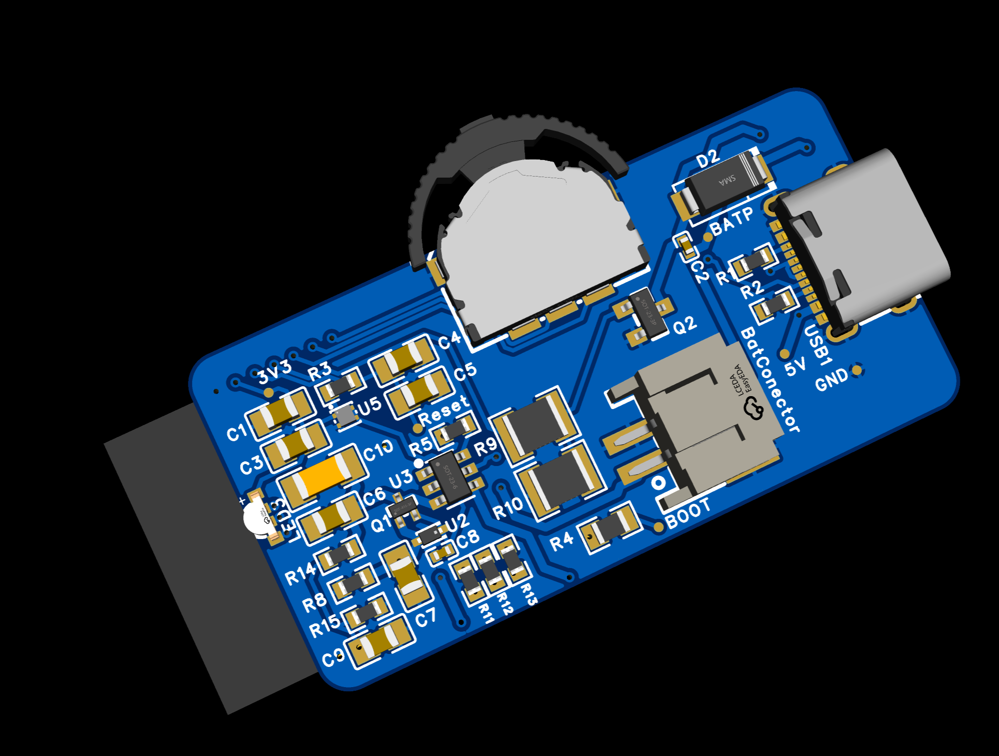
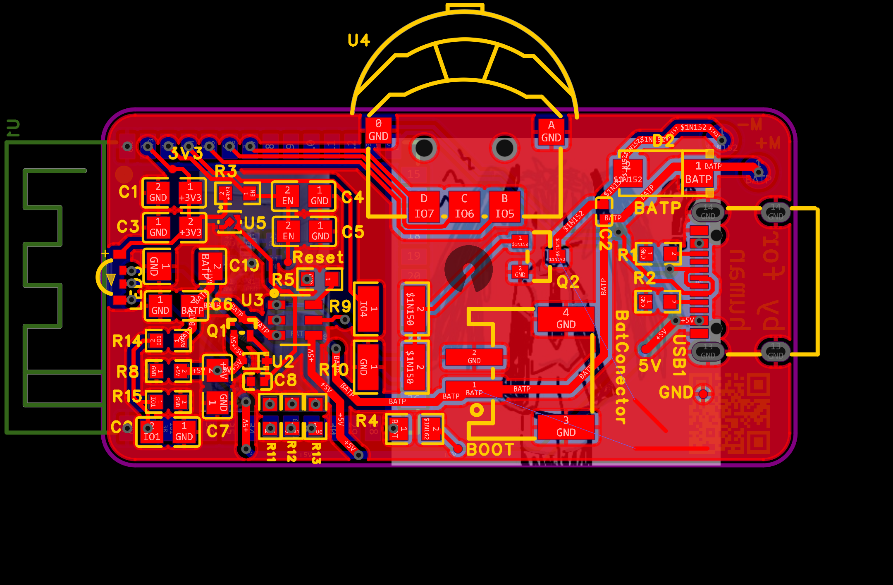
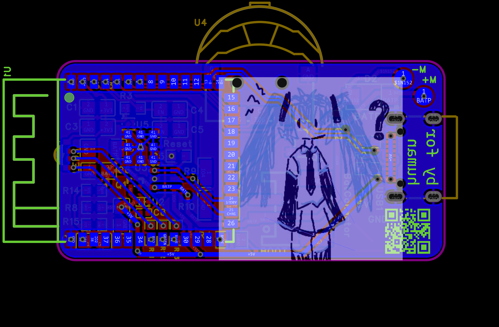
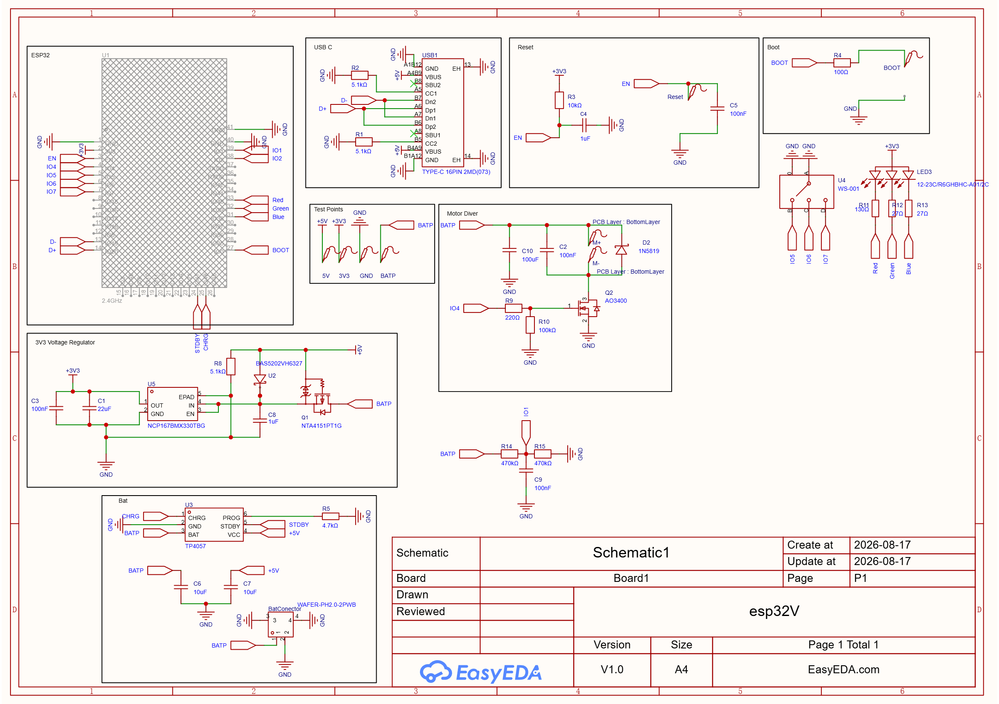

# Open Source EMDR Pulsers

**Wireless EMDR pulsers built around the ESP32 and ESP-NOW.**

An open-source and affordable alternative to expensive closed hardware.

---

## About

This project started with a simple idea: **make wireless EMDR pulsers that are open, affordable, and hackable.**

Commercial EMDR pulser devices can be surprisingly expensive and are often closed systems. I wanted to explore what could be built using readily available electronics and an open design.

The current hardware is based around the **ESP32**, with the pulsers designed to communicate wirelessly using **ESP-NOW**.

The hardware is being developed first. Firmware and a companion application are planned as the project progresses.

> **This is an open-source electronics project and is not a certified medical device.**
> Please read the [Disclaimer](#disclaimer) before building or using the hardware.

---

## Features

- 📡 Wireless communication using **ESP-NOW**
- 🧠 ESP32-based hardware
- 🔓 Open-source PCB design
- 💰 Designed with affordability in mind
- 🛠️ PCB manufacturing files included
- 📐 Schematic and BOM included
- 🧩 3D STEP model included
- 💡 Built-in LED available for future functionality
- 📱 Companion software planned
- 🤝 Designed to be modified, improved, and built by others

---

## The Hardware

### PCB — Front

### PCB — Back

### Schematic

The repository also contains the full schematic as a PDF for easier inspection and reference.

---

## Wireless Communication

The pulsers are designed around **ESP-NOW**, allowing ESP32 devices to communicate directly without requiring a traditional Wi-Fi network.

The basic idea is to keep the system simple and self-contained:

    Controller / Future App
             |
             |
          ESP-NOW
             |
       +-----+-----+
       |           |
    Pulser L    Pulser R
      ESP32       ESP32
       |           |
       +---ESP-NOW-+

Using ESP-NOW means the devices don't need to rely on a Wi-Fi router or local network for their basic communication.

This also leaves room for future features such as:

- Device pairing
- Synchronization
- Status information
- Configuration
- Remote control
- Communication with a future companion application

---

## Hardware

The current repository contains the main files needed to manufacture, inspect, and modify the PCB.

| File | Description |
|---|---|
| `Gerber_PCB1_*.zip` | PCB manufacturing files |
| `BOM_Board1_PCB1_*.xlsx` | Bill of materials |
| `Schematic.pdf` | Full electrical schematic |
| `Schematic.png` | Schematic preview |
| `front.png` | PCB front image |
| `back.png` | PCB back image |
| `Pic.png` | Project image |
| `3D.step` | 3D CAD model |
| `esp32V.eprj2` | Electronic design project |

The exact filenames may change as the hardware goes through future revisions.

### Design Philosophy

The hardware is intentionally open.

If you want to:

- Manufacture your own boards
- Modify the PCB
- Design an enclosure
- Experiment with different components
- Write your own firmware
- Build your own controller
- Integrate the hardware into another project

you should be able to start from the files in this repository.

---

## Software

The software side of the project is **not finished yet**.

The plan is to develop firmware for the ESP32 pulsers and eventually create a companion application for configuring and controlling the devices.

### Planned Firmware

- [ ] Initial ESP32 firmware
- [ ] ESP-NOW communication
- [ ] Pulser pairing
- [ ] Left/right device identification
- [ ] Synchronization
- [ ] Pulser control
- [ ] Configurable patterns
- [ ] Speed/frequency configuration
- [ ] Intensity control
- [ ] Session controls
- [ ] Device status
- [ ] Battery information
- [ ] Built-in LED status indicators
- [ ] Error handling and failsafe behaviour

### Planned Application

- [ ] Initial application prototype
- [ ] Device discovery
- [ ] Pairing
- [ ] Device configuration
- [ ] Pattern controls
- [ ] Session controls
- [ ] Device status
- [ ] Battery information
- [ ] Cross-platform support

The exact software architecture is still open and may change during development.

---

## Project Status

This project is actively being developed.

| Component | Status |
|---|---|
| PCB design | 🟢 Available |
| Electrical schematic | 🟢 Available |
| BOM | 🟢 Available |
| Gerber files | 🟢 Available |
| 3D model | 🟢 Available |
| ESP32 hardware | 🟢 Designed |
| ESP-NOW firmware | 🟡 Planned |
| Pulser firmware | 🟡 Planned |
| Built-in LED functionality | 🟡 Planned |
| Companion application | 🟡 Planned |
| Enclosure | 🔴 Not finished |
| Final testing | 🟡 In progress |

**🟢 Available**  
**🟡 Planned / In development**  
**🔴 Not completed**

---

## Roadmap

### Hardware

- [x] Initial PCB design
- [x] Electrical schematic
- [x] Bill of materials
- [x] Gerber manufacturing files
- [x] 3D model
- [x] Built-in LED included in the hardware design
- [ ] Build and test additional boards
- [ ] Finalize PCB revision
- [ ] Design enclosure
- [ ] Document assembly process
- [ ] Document power and battery setup
- [ ] Publish hardware test results
- [ ] Improve documentation

### Firmware

- [ ] Initial ESP32 firmware
- [ ] ESP-NOW communication
- [ ] Device pairing
- [ ] Left/right identification
- [ ] Synchronization
- [ ] Pulser control
- [ ] Configuration
- [ ] LED status feedback
- [ ] Error handling / failsafe behaviour
- [ ] Battery and device status

### Application

- [ ] First prototype
- [ ] Device discovery
- [ ] Pairing
- [ ] Configuration
- [ ] Pattern controls
- [ ] Session controls
- [ ] Device status
- [ ] Cross-platform support

---

## Building Your Own

The goal is for anyone with the necessary electronics skills and equipment to be able to reproduce the hardware.

### 1. Manufacture the PCB

Use the included Gerber archive with your preferred PCB manufacturer.

### 2. Source the Components

The BOM contains the components used by the current PCB revision.

Before ordering components, check that the BOM matches the PCB revision you intend to build.

### 3. Assemble the PCB

Assemble the board according to the schematic and BOM.

### 4. Inspect Before Powering

Before applying power:

- Check component orientation
- Inspect all solder joints
- Look for solder bridges
- Check for shorts between power rails
- Verify the expected supply voltage
- Check the ESP32 connections
- Check the pulser/motor connections

### 5. Firmware

Firmware flashing instructions will be added once the firmware reaches a usable state.

---

## Contributing

This project is still fairly early, so there is plenty of room to contribute.

Some areas where contributions would be especially useful:

- Firmware development
- ESP-NOW communication
- Synchronization
- PCB improvements
- Enclosure design
- Battery and power design
- Application development
- Testing
- Documentation
- Accessibility
- Manufacturing improvements

If you build the hardware yourself, improvements and feedback are very welcome.

Found a problem or have an idea?

**Open an issue or submit a pull request.**

---

## Disclaimer

This project is provided as an **open-source electronics project for educational, experimental, and maker purposes**.

It is **not a certified medical device** and has not been presented as clinically validated or approved for medical treatment.

Building and using the hardware is your own responsibility.

The author and contributors are not responsible for damage, injury, misuse, or other consequences resulting from the construction or use of this project.

Always consider appropriate electrical, battery, mechanical, and software safety when building and testing the hardware.

If you are using EMDR as part of mental-health treatment, this project should not be considered a replacement for a qualified healthcare professional.

---

---

## License

See the repository for the applicable license.

If you build upon this project, please respect the license terms and consider sharing your improvements back with the community.

---

**Built with curiosity, open hardware, and a lot of solder.**
